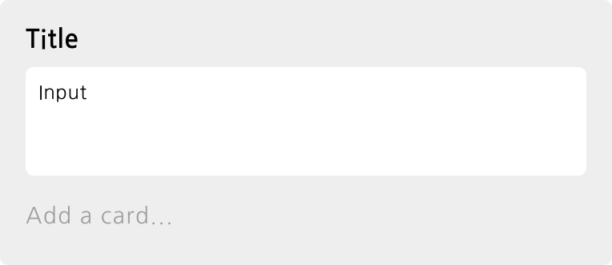
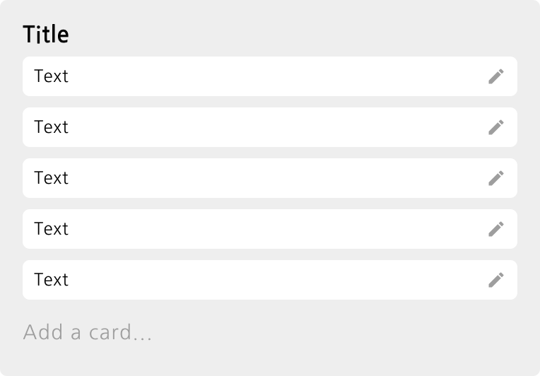
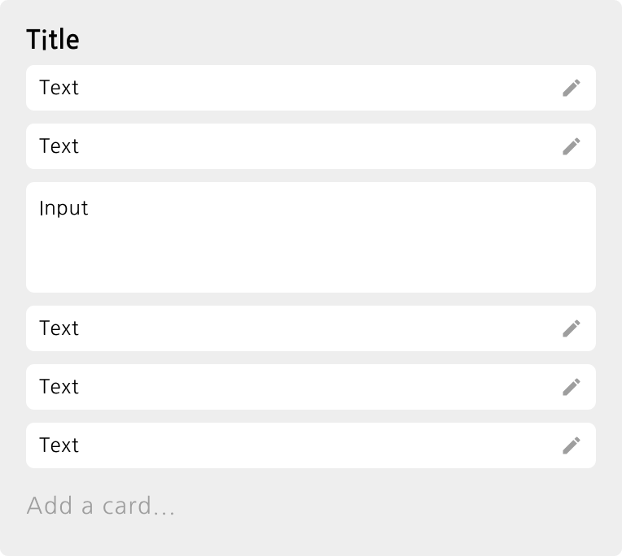

# vanilla-trello

Vanilla JS로 Trello 구현하기.

프런트엔드 중심으로 구현을 진행하였으며, 다음의 요구사항에 따라 구현.

- Frontend
  - 텍스트를 입력할 수 있는, 그리고 드래그가 가능한 카드
  - 카드 목록
  - 다른 클라이언트와 자동으로 동기화
  - 외부 모듈 사용 금지
- Backend
  - 하나의 클라이언트에서 데이터가 업데이트 되는 경우, 이를 브로드캐스팅

과제를 진행하며 알게 된 내용들 중 실제 과제를 해결하는 것과는 직접적으로 연관되지 않는 아티클 두 개를 작성하였으며, 아래의 링크에서 확인하실 수 있다.

- [stale-while-revalidate Cache-Control extension](https://n.shj.rip/UX-stale-while-revalidate-Cache-Control-extension-86866b92bfc742f7bc2c0dc9d5696d71)
- [Service Worker를 이용한 Assets Caching](https://n.shj.rip/UX-Service-Worker-Assets-Caching-bc900e3fcc714a7eb81d3ffb8cdf6f37)

## 목차

- [Getting started](#getting-started)
  - [Dependencies](#dependencies)
  - [Vite](#vite)
- [Features](#features)
  - [Components](#components)
  - [Functions](#functions)
- [Demo video](#demo-video)

## Getting started

vanilla-trello는 [Yarn workspaces](https://classic.yarnpkg.com/en/docs/workspaces/) 기반의 monorepo로 구성하였으며, 다음의 명령으로 설치 및 실행이 가능.

```sh
# clone this repository
git clone https://github.com/Gumball12/vanilla-trello # private repo
cd vanilla-trello

# install dependencies
yarn

# 1. start static web dev server (frontend)
yarn front-dev

# 2. start application web dev server (backend)
yarn back-dev
```

참고로 Front, Back 실행 순서는 어떠한 것을 먼저 실행해도 정상 작동함.

### Dependencies

설치되는 모듈은 다음과 같음.

- Share
  - babel, jest (unit test)
  - chalk, yorkie (verify commit message)
- Backend
  - express (web framework)
  - compression (compression data)
  - ws ([WebSocket](https://developer.mozilla.org/en-US/docs/Web/API/WebSocket) server)
- Frontend
  - vite (build tool)

### Vite

프런트엔드 개발을 진행하며 [ViteJS](https://vitejs.dev) 빌드 툴을 이용함. 물론 [Native ESM(EcmaScript-Module)](https://developer.mozilla.org/en-US/docs/Web/JavaScript/Guide/Modules)을 완벽하게 지원하도록 구현했기에, `live-server`와 같은 Static Web Server만으로도 에러 없이 구동이 가능.

그럼 Vite을 사용한 이유는 무엇일까? 여기에는 다음의 이점이 있다.

- Static Web Server로 이용이 가능
- ESM 기반의 빠른 HMR(Hot-Module-Replacement) 가능
- 수정되지 않은 JavaScript 소스는 자동으로 캐싱 (`304 Not-Modified`)

이러한 이점을 가진 Vite을 이용하면 빠르고 수월하게 개발을 진행할 수 있기에, 이를 이용해 개발을 진행하게 됨.

참고로 당연히 실제 애플리케이션에는 명시된 제한사항과 같이 Google Material Icon CSS 파일 하나만을 제외하고 외부 모듈을 일체 사용하지 않았으며, 모든 모듈은 모두 직접 구현하여 작성함.

## Features

### Components

실제 개발 전, Figma를 이용해 컴포넌트 단위의 프로토타이핑을 진행함. 아래의 링크로 접속이 가능.

[Components (Figma)](https://www.figma.com/file/58DY3lnxAfbkWScAF2Ape8/mini-trello?node-id=2%3A0)

구현된 컴포넌트는 다음과 같습니다.

#### CardBox components

_CardBox components_


_AddCardPanel component_


- [CardBox](./workspaces/frontend/src/components/CardBox.js): 콘텐츠를 갖고 있는 Card 컴포넌트 (draggable)
- [AddCardPanel](./workspaces/frontend/src/components/ListBox/AddCardPanel.js): CardBox를 추가하는 버튼

#### ListBox components

_ListBox Components_








_AddListPanel component_


- [ListBox](./workspaces/frontend/src/components/ListBox/index.js): CardBox 목록을 갖고 있는 컴포넌트
- [AddListPanel](./workspaces/frontend/src/components/AddListPanel.js): ListBox를 추가하는 버튼

#### Main components

_TitleBox component_


- [TitleBox](./workspaces/frontend/src/components/TitleBox.js): 타이틀 컴포넌트
- [MainComponent](./workspaces/frontend/src/components/MainComponent.js): `<main>` 태그 컴포넌트

#### Share components

_InputBox component_


_AddPanel component_


- [InputBox](./workspaces/frontend/src/components/share/InputBox.js): Input field
- [TextareaBox](./workspaces/frontend/src/components/share/TextareaBox.js): Textarea field
- [IconBox](./workspaces/frontend/src/components/share/IconBox.js): Icon button
- [AddPanel](./workspaces/frontend/src/components/share/AddPanel.js): CardBox 및 ListBox를 추가하는 버튼
- [SwapFieldBox](./workspaces/frontend/src/components/share/SwapFieldBox.js): 클릭 시 Input/Textarea field와 Card를 Swap하는 컴포넌트

### Functions

VanillaJS 기반으로 다음의 기능을 구현함.

- [Service Worker](https://developer.mozilla.org/en-US/docs/Web/API/Service_Worker_API) 및 [Cache Storage](https://developer.mozilla.org/en-US/docs/Web/API/CacheStorage) API를 이용해 `fetch` 이벤트를 후킹 및 요청하는 폰트 에셋 캐싱
- [Web Socket](https://developer.mozilla.org/en-US/docs/Web/API/WebSocket)을 이용하여 다른 클라이언트와 실시간 데이터 연동
- 데이터를 서버로 전송 시 [Throttling을 구현](./workspaces/frontend/src/share/sock.js)해 한 번에 다량의 데이터가 전송되지 않게끔 함
- [Web Components](https://developer.mozilla.org/en-US/docs/Web/Web_Components) 기반의 [MVVM 프레임워크 및 Reactive data models를 구현](./workspaces/frontend/src/share/MvvmHtmlElement/MvvmHTMLElement.js)해 확장성 있는 컴포넌트 및 애플리케이션 구성
- [Native ESM](https://developer.mozilla.org/en-US/docs/Web/JavaScript/Guide/Modules) 기반으로 JavaScript 코드 모듈화
- Provider 패턴의 [Global state 구현](./workspaces/frontend/src/state.js)
- [드래그 앤 드롭](./workspaces/frontend/src/share/dnd/index.js)

## Demo video

[Demo video](https://user-images.githubusercontent.com/28308362/119359049-2ab4f600-bce4-11eb-858e-22518cb8c71a.mp4)

